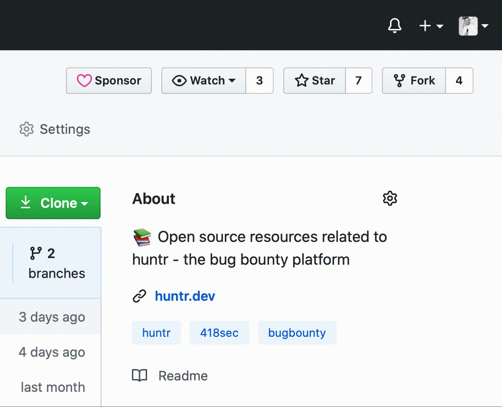

 

<b><a href="https://huntr.dev/" _target="blank">huntr.dev</a> - the place to protect open source</b>

<kbd style="font-size:12px;background-color:black;">Get recognised for protecting millions of developers...</kbd>

 

 

 

<a href="https://huntr.dev" target="_blank"><b>Visit the platform</b></a> or continue reading...

 

  <a href="#how-to-use"><b>About</b></a> •
  <a href="#download"><b>Disclose</b></a> •
  <a href="#credits"><b>Fix</b></a> •
  <a href="#related"><b>Links</b></a>

## About

## Disclose

<b>Existing disclosures are labelled with: </b>  

## Fix

## Links

# huntr
[huntr](https://www.huntr.dev) is a bug bounty board specifically for identifying and fixing vulnerabilities in open source code.

# Readme
Hello and welcome to the huntr public repo, where you will find:
- [Bounty templates](https://github.com/418sec/huntr/tree/master/bounties)
- Bounty files
- Misc information

# Updates
 
 We develop and release new features bi-weekly, so remember to star and watch the repo to make sure you are notified of significant updates.

 
  

# Useful links

If you'd like to disclose a vulnerability, [click here](https://github.com/418sec/huntr/compare/staging...staging?template=disclose-vulnerability.md)

If you'd like to sponsor huntr, [click here](https://www.paypal.me/418sec)

If you are a package maintainer and want to get in touch, [click here](https://www.huntr.dev/contact-us)

To join us on Discord, [click here](https://discord.gg/6wVS2dm)

To follow us on Twitter, [click here](https://twitter.com/huntrdev)
