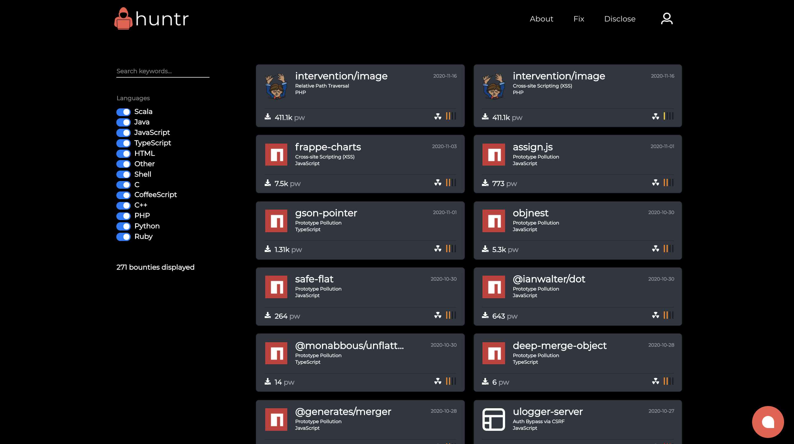
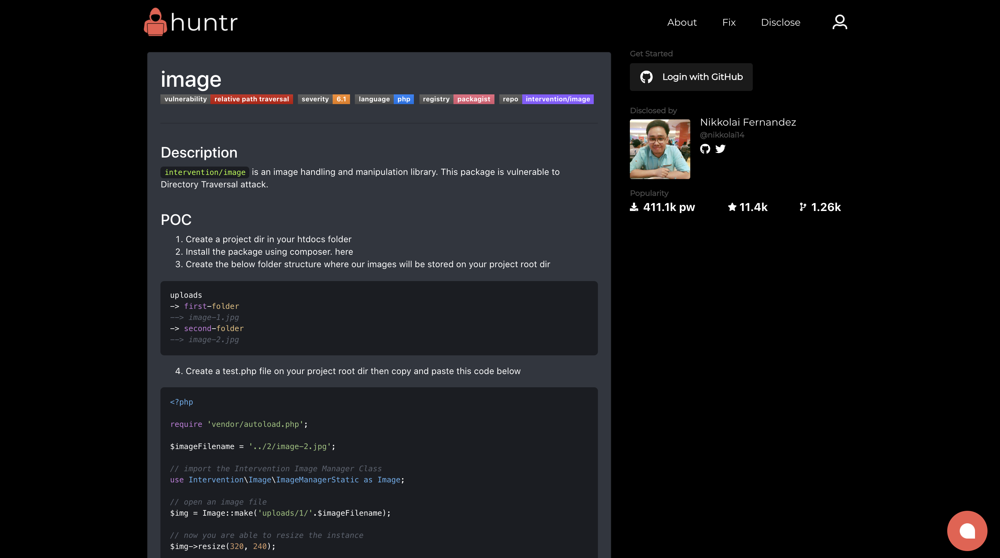
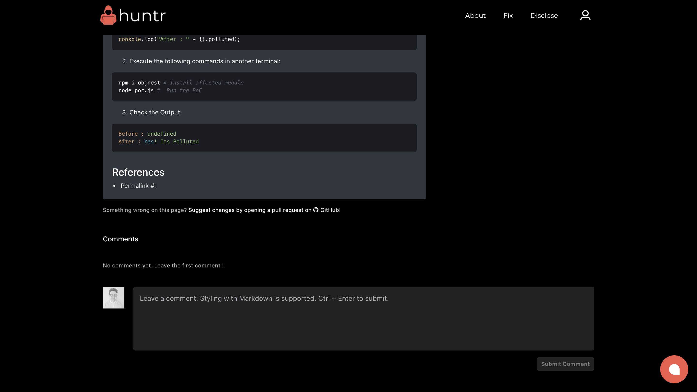
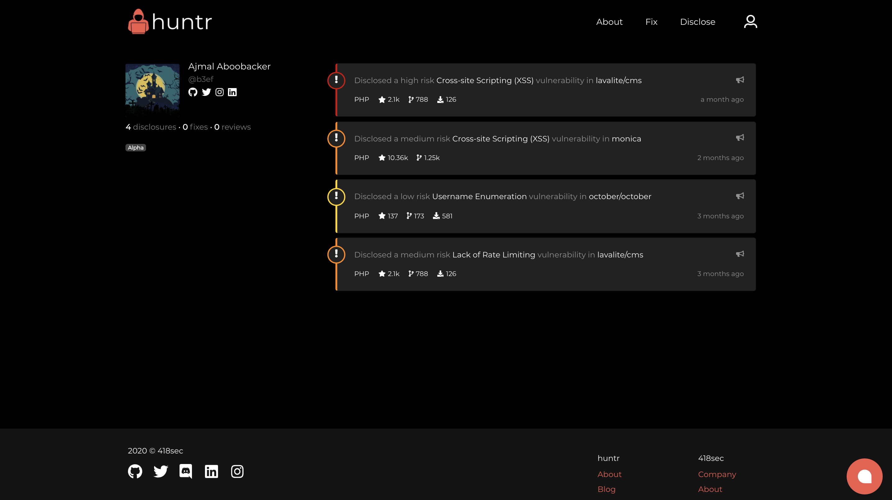

<p align="center">
  <b>We no longer accept vulnerability disclosures through our repository. To disclose a new vulnerability, please use our <a href="https://huntr.dev/bounties/disclose">form</a>.</b>
</p>
<p align="center">
<a href="https://huntr.dev/" target="_blank"></a>
</p>
<p align="center">
<hr />
</p>
<br />
<p align="center">
<b><a href="https://huntr.dev/" _target="blank">huntr.dev</a> - the place to protect open source</b>
</p>
<p align="center">
<code style="font-size:12px;background-color:black;">Get recognised for protecting millions of developers</code>
</p>
<br />
<p align="center">
<a href="https://github.com/418sec/huntr/actions?query=workflow%3A%22Process+bounties%22" target="_blank"></a>
<a href="https://huntr.dev/" target="_blank"></a>
<a href="https://github.com/418sec/huntr/pulls" target="_blank"></a>
<a href="https://github.com/418sec/huntr/issues" target="_blank"></a>
</p>
<br />
<p align="center">
<a href="https://github.com/418sec/huntr/fork"></a>

<a href="https://github.com/418sec/huntr/graphs/contributors" target="_blank"></a>
<a href="https://paypal.me/418sec" target="_blank"></a>
<a href="https://github.com/418sec/huntr/pulls?q=is%3Apr+is%3Aopen+label%3Adisclosure" target="_blank"></a>
</p>
<br />
<p align="center">
<a href="https://huntr.dev/discord"></a>
<a href="https://twitter.com/huntrdev"></a>
</p>
<br />
<p align="center"><a href="https://huntr.dev" target="_blank"><b>Visit the platform</b></a> or continue reading...</p>
<p align="center">
<a href="https://huntr.dev" target="_blank"></a>
<a href="https://huntr.dev" target="_blank"></a>
</p>
<p align="center">
<a href="https://huntr.dev" target="_blank"></a>
<a href="https://huntr.dev" target="_blank"></a>
</p>
<hr />
<p align="center">
  <a href="#about"><b>About</b></a> •
  <a href="#disclose"><b>Disclose</b></a> •
  <a href="#fix"><b>Fix</b></a> •
  <a href="#discuss"><b>Discuss</b></a> •
  <a href="#links"><b>Links</b></a> •
  <a href="#updates"><b>Updates</b></a> •
  <a href="#community"><b>Community</b></a>
</p>
<hr />

## About

<br />

<a href="https://huntr.dev"><b>huntr</b></a> is a bug bounty platform developed by <a href="https://418sec.com"><b>418sec</b></a>. We provide the open source community a way to learn and master open source security with real world practice on packages being utilised by millions of developers and services around the world.

This repository is an _open_ and _freely_ available database for all of the disclosures we have received from the open source community. We display these disclosures on our platform for you to learn about, attempt a fix and discuss with others.

You already have what it takes. Keep reading to learn more on how to disclose a vulnerability, submit a fix and share your opinions with us.

_If you want to do a bit more reading around the platform and our mission, take a look at_:

- [Our Blog](https://huntr.dev/blog)
- [AWS Open Source Blog](https://aws.amazon.com/blogs/opensource/how-a-startup-wants-to-help-secure-the-open-source-ecosystem-with-huntr-a-bug-bounty-board/)

<br />

## Disclose

<br />

_For the best experience when disclosing a vulnerability with us, [sign up](https://huntr.dev/profile) to the platform using your GitHub account._

<br />

Before disclosing a vulnerability, you should fork the repository and familiarise yourself with the contents of your new repo. You can fork by clicking here:

<br />

<a href="https://github.com/418sec/huntr/fork"></a>

<br/>

### Database 💽

<br />

The `bounties` folder holds all previous disclosures and is also the location where new disclosures are added. Inside the `bounties` folder, each directory represents a _package manager_. These include:

<br />

<a href="https://maven.apache.org/"></a>
<a href="https://npmjs.com"></a>
<a href="https://packagist.org/"></a>
<a href="https://pip.pypa.io/en/stable/"></a>
<a href="https://rubygems.org/"></a>


<br />

Within each of these folders, you will find the names of packages that are served by these package managers. For example, `bounties/npm/yup` refers to:

<br />

<a href="https://www.npmjs.com/package/yup"></a>

<br />

Some package managers (i.e. <a href="https://packagist.org/"></a>) format their package names like `owner/name`, e.g. <a href="https://packagist.org/packages/intervention/image"><b>intervention/image</b></a>. Where this is the case, the package directory assumes the following structure:

```
bounties
  - packagist
    - intervention
      - image
```

<br />

_Otherwise_, it will follow:

```
bounties
  - npm
    - yup
```

<br />

Inside of each package directory, there will be a numbered list of directories starting at `1`. This number is the identifier for the vulnerability/disclosure. For example, `bounties/npm/yup/1` is the first disclosure in our database for <a href="https://www.npmjs.com/package/yup"><b>yup</b></a>.

<br />

This number, as well as the directory, refers to the respective vulnerability on the platform. The contents of the files inside a directory location will be used to generate the content for the platform vulnerability page:

<br />

https://huntr.dev/bounties/1-npm-yup

<br />

Each _new_ and _unique_ disclosure should iterate on this number, if the package for a specific package manager does not already exist.

<br />

### Submit a disclosure 📨

<br />

Now that we have covered the basics of the vulnerability database, we can now submit a disclosure...

<br />

Each disclosure is made up of two files:

<br />

`vulnerability.json` and a `README.md`

<br />

The `vulnerability.json` contains all meta-data related to the vulnerability or disclosure. You can find a template below for the `vulnerability.json` which should be filled with relevant information. The `README.md` is a custom description of the disclosure that will appear on the platform. It is rendered with a simple Markdown processor that includes basic styling - similar to GitHub Flavoured Markdown. You can be as creative and artistic with your `README.md` as you please. These files are created by a discloser, within an existing or new package manager and package of choice.

For example, if you wanted to disclose a vulnerability in:

<br />

<a href="https://www.npmjs.com/package/lodash"></a>

<br />

...you will create two empty files on your personal fork:

<br />

```json
bounties/npm/lodash/1/vulnerability.json
```

```json
bounties/npm/lodash/1/README.md
```

<br />

### `vulnerability.json`

<br />

Your `vulnerability.json` must take the following format to get accepted:

<br />

```json
{
  "PackageVulnerabilityID": "",
  "DisclosureDate": "",
  "AffectedVersionRange": "",
  "Summary": "",
  "Contributor": {
    "Discloser": "",
    "Fixer": ""
  },
  "Package": {
    "Registry": "",
    "Name": "",
    "URL": "",
    "Downloads": ""
  },
  "CWEs": [
    {
      "ID": "",
      "Description": ""
    }
  ],
  "CVSS": {
    "Version": "",
    "AV": "",
    "AC": "",
    "PR": "",
    "UI": "",
    "S": "",
    "C": "",
    "I": "",
    "A": "",
    "E": "",
    "RL": "",
    "RC": "",
    "Score": ""
  },
  "CVEs": [""], 
  "Repository": {
    "URL": "",
    "Codebase": [""],
    "Owner": "",
    "Name": "",
    "Forks": "",
    "Stars": ""
  },
  "Permalinks": [""], 
  "References": [
    {
      "Description": "",
      "URL": ""
    }
  ],
  "PrNumber": ""
}
```

<br />

Furthermore, the contents of each key must have a value that follows the definition table:

<br />

<b>
<table style="text-align:right;">
<th>Field</th><th>Definition</th><th>Example</th>
<tr><td>PackageVulnerabilityID</td><td>Numerical incrementing ID</td><td>1</td></tr>
<tr><td>DisclosureDate</td><td>Disclosure submission date</td><td>2020-12-01</td></tr>
<tr><td>AffectedVersionRange</td><td>Vulnerable version/s of the package</td><td>* or 1.0.0</td></tr>
<tr><td>Summary</td><td>Summary of the vulnerability</td><td>Prototype Pollution</td></tr>
<tr><td>Contributor.Discloser</td><td>GitHub ID of the discloser</td><td><i>No input required...</i></td></tr>
<tr><td>Contributor.Fixer</td><td>GitHub ID of the fixer</td><td><i>No input required...</i></td></tr>
<tr><td>Package.Registry</td><td>Name of package manager/registry</td><td>npm</td></tr>
<tr><td>Package.Name</td><td>Name of the vulnerable package</td><td>lodash</td></tr>
<tr><td>Package.URL</td><td>URL to the package in the registry</td><td>https://www.npmjs.com/package/lodash</td></tr>
<tr><td>CWEs.ID</td><td>Common Weakness Enumeration ID of the vulnerability</td><td>400</td></tr>
<tr><td>CWEs.Description</td><td>Name of the CWE ID</td><td>Failure to Sanitize Input</td></tr>
<tr><td>CVSS.Version</td><td>Version of CVSS Calculator</td><td>3.1</td></tr>
<tr><td>CVSS.AV</td><td>Attack Vector</td><td>P</td></tr>
<tr><td>CVSS.AC</td><td>Attack Complexity</td><td>H</td></tr>
<tr><td>CVSS.PR</td><td>Privileges Required</td><td>L</td></tr>
<tr><td>CVSS.UI</td><td>Privileges Required</td><td>L</td></tr>
<tr><td>CVSS.S</td><td>Scope</td><td>L</td></tr>
<tr><td>CVSS.C</td><td>Confidentiality</td><td>L</td></tr>
<tr><td>CVSS.I</td><td>Integrity</td><td>L</td></tr>
<tr><td>CVSS.A</td><td>Availability</td><td>L</td></tr>
<tr><td>CVSS.E</td><td>Exploit Code Maturity</td><td>L</td></tr>
<tr><td>CVSS.RL</td><td>Remediation Level</td><td>L</td></tr>
<tr><td>CVSS.RC</td><td>Report Confidence</td><td>L</td></tr>
<tr><td>CVSS.Score</td><td>Common Vulnerability Scoring System</td><td>9.8</td></tr>
<tr><td>CVEs</td><td>Common Vulnerabilities and Exposures (CVE)</td><td><code>["CVE-abc-123"]</code><i>- optional</i></td></tr>
<tr><td>Repository.URL</td><td>GitHub Repository URL</td><td>https://github.com/418sec/huntr</td></tr>
<tr><td>Repository.Codebase</td><td>GitHub Repository Codebase</td><td><code>["JavaScript"]</code></td></tr>
<tr><td>Repository.Owner</td><td>GitHub Repository Owner</td><td>418sec</td></tr>
<tr><td>Repository.Name</td><td>GitHub Repository Name</td><td>huntr</td></tr>
<tr><td>Permalinks</td><td>GitHub Permalinks</td><td><code>["https://github.com/418sec/huntr/blob/staging/.gitignore#L1"]</code></td></tr>
<tr><td>References</td><td>Links or Articles relating to vulnerability</td><td><code>{
      "Description": "Blog",
      "URL": "https://huntr.dev/blog"
    }</code></td></tr>
</table>
</b>

<br />

<p align="center"><i>Data Definition Table for vulnerability.json</i></p>

<br />

<br />

For more information on the requested meta-data, you can refer to the following resources:

- [CVE - Common Vulnerabilities and Exposures](https://cve.mitre.org/)
- [CVSS - Common Vulnerability Scoring System](https://www.first.org/cvss/calculator/3.1)
- [CWE - Common Weakness Enumeration](https://cwe.mitre.org/)
- [How to create a permalink with GitHub](https://docs.github.com/en/github/managing-your-work-on-github/creating-a-permanent-link-to-a-code-snippet)

<br />


### `README.md`

<br />

The `README.md` file is fully customisable, but you can use the following template:

```md
# Description

`myPackage` is vulnerable to `a scary vulnerability`.

This exploit may result in the modification of..., which may result in...

# Proof of Concept

1. Create the following PoC file:

{Show PoC code here...}

2. Execute the following commands in another terminal:

{Show terminal commands here...}

3. Check the Output:

{Show result of execution here...}

```

_N.B - ensure that any hyperlinks or URLs are added to the `References` array in the `vulnerability.json`_

<br />

### Disclosure Acceptance 🎉

<br />

If you are up to this point, great job! You can now go ahead and open a pull request from your fork to `418sec/huntr:staging`. Make sure that you have submitted only one `vulnerability.json` and `README.md` per pull request. If you do this properly, a  label will be added to your PR.

<br />

All previous disclosure PRs are labelled with:<br />


<br />

Before being accepted, your `vulnerability.json` will go through some checks to ensure a minimum level of quality. If your disclosure fails these checks, you will be able to view the results of these checks at the bottom of your PR.

<br />

Once your disclosure has passed the minimum quality checks, it will be automatically merged and be visible on the platform under the URL:

```url
https://huntr.dev/bounties/${PackageVulnerabilityID}-${Package.Registry}-${Package.Name}
```

<br />
<br />
<p align="center">
<i>Need more help? Take a look at our video walkthrough for more information...</i>
</p>
<p align="center">
<a href="https://www.youtube.com/watch?v=KBB5YtU84F8" title="How to disclose with huntr and GitHub"></a>
</p>

<br />

## Fix

<br />

_For the best experience when fixing a vulnerability with us, [sign up](https://huntr.dev/profile) to the platform using your GitHub account._

<br />

All of our submitted disclosures will be displayed on the [bounties](https://huntr.dev/bounties) page on the platform. You can filter by programming language and view disclosures ordered by most recent, first.

<br />

### Submit a fix ⚒️

<br />

To start working on a fix, visit any bounty page and click the <b>Fork and Fix</b> button. This will only be visible if you have [signed up](https://huntr.dev/profile) with your GitHub account. This will create a fork of a `418sec` GitHub repository; we have forked the upstream repository so that we don't bother the true maintainer with heavy discussion threads on their repository.

<br />

For example:

```
lodash/lodash
|_418sec/lodash
  |_YOUR-USERNAME/lodash
```

<br />

Once you have forked through our platform, you will be provided a `git clone` command. With this, you can start working on your fork and building your fix, woohoo! 🎉

<br />

Once you are happy with your fix on your forked repository, you can now open up a pull request from your fork to the `418sec` repository.

<br />

We encourage you to reference your pull request submission on the original disclosure through the comments section on the platform. To do this, simply copy your GitHub PR URL into the comments section. This will automatically setup a linked reference to your PR. This will give you the opportunity to get community feedback on your fix and learn with others on their submissions too.

<br />

## Discuss

<br />

We encourage everyone to engage in the discourse for vulnerability disclosures and fixes through our platform. To sign up, [click here](https://huntr.dev/profile). You will find a comments section on each bounty page where you can express your thoughts and learn with others.

<br />

If you have any feedback about this repository or the platform, get involved with the conversation on our [Discord](https://discord.gg/6wVS2dm). Join our growing community today!

<br />

## Links

<br />

_You may find the following links helpful:_

- [Platform](https://huntr.dev)
- [Blog](https://huntr.dev/blog)
- [Previous Disclosures](https://github.com/418sec/huntr/pulls?q=label%3Adisclosure)
- [Sponsor Us](https://www.paypal.me/418sec)
- [Contact Us](https://www.huntr.dev/contact-us)
- [Discord](https://discord.gg/6wVS2dm)
- [Twitter](https://twitter.com/huntrdev)
- [Team](https://418sec.com)

<br />

### Templates

<br />

Not sure what to write in the description of your pull request? You can use our PR (pull request) templates to help you:

<br />

- [Disclosure Template](https://github.com/418sec/huntr/blob/staging/.github/PULL_REQUEST_TEMPLATE/disclose-vulnerability.md)
- [Fix Template](https://github.com/418sec/.github/blob/master/PULL_REQUEST_TEMPLATE.md)

<br />

## Updates

<br />

<p align="center">
<i>Turn your notifications to <i>watching</i> to keep yourself up-to-date. To show us some love, give us a star!</i>
</p>

<p align="center" width="100">

</p>

<br />

## Community

<br />

_You can find community-based projects here:_

- [HuntrBot](https://github.com/Asjidkalam/HuntrBot)
